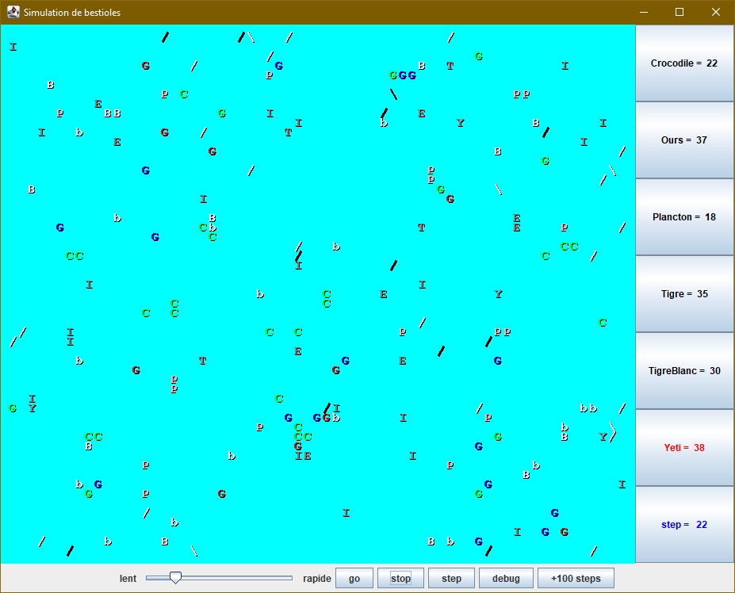

# TP Bestioles

Vous devez définir un ensemble de classes qui définissent le comportement de certains animaux. Vous disposez d'un programme fonctionnel qui fait tourner une simulation d'un monde peuplé d'animaux. Chaque animal se comporte différemment. Voici ce à quoi ça ressemble :



## Description de la solution

Commencez par cloner ce dépôt, puis testez la simulation. La méthode `main` se trouve dans la classe `BestioleApp`.

Chaque objet est une « bestiole ». `Bestiole` est une superclasse qui définit le comportement par défaut. Vous devez écrire cinq classes, chacune représentant un animal diffférent : `Ours`, `Tigre`, `TigreBlanc`, `Yeti` et `ChatNinja`. Ce sont toutes des sous-classes (et donc elles dérivent) de `Bestiole`. Vous ne devez pas modifier le code qui gère les « tours » de la simulation : ce code est déjà fourni et fonctionnel (il s'agit de tous les fichiers commençant par le mot _Bestiole_). À chaque tour, la simulation demande à chaque bestiole trois informations :

1. Que vas-tu faire ?
2. De quelle couleur es-tu ?
3. Par quelle chaîne de caractère doit-on te représenter ?

Ces trois informations sont fournies par des méthodes publiques présentes dans la superclasse. Votre travail consiste à créer des classes pour chaque bestiole et à redéfinir le comportement correct pour chaque bestiole, en redéfinissant ces trois méthodes :

```java
// 1. Que vas-tu faire ?
public Action getAction(BestioleInfo info) {
  ...
}

// 2. De quelle couleur es-tu ?
public Color getCouleur() {
  ...
}

// 3. Par quelle chaîne de caractère doit-on te représenter ?
public String toString() {
  ...
}
```

Par exemple, voici la classe `Plancton` dont les objets apparaissent toujours sous la forme d'un « P » vert et qui essaient toujours d'infecter n'importe quelle bestiole qui se trouverait devant eux :

```java
import java.awt.*;

public class Plancton extends Bestiole {

    public Action getAction(BestioleInfo info) {
        return Action.INFECTER;
    }

    public Color getCouleur() {
        return Color.GREEN;
    }

    public String toString() {
        return "P";
    }
}
```

Toutes vos classes d'animaux auront ce format. Il sera bien sûr possible d'ajouter des méthodes privées et des attributs privés pour impémenter le comportement de chaque bestiole.

> Note : l'importation de `java.awt` permet d'accéder à la classe `Color`.

## Comportement des classes

Cette section décrit le comportement attendu pour chaque bestiole à implémenter. Vous devez respecter ces spécifications.

### Ours

- Constructeur : `public Ours(boolean polaire)`
- `getCouleur` :
  - `Color.WHITE` pour un ours polaire (si `polaire` est `true`)
  - `Color.BLACK` sinon (si `polaire` est `false`)
- `toString` : alterne à chaque mouvement entre `/` et `\` (en commençant avec un slash `/`).
- `getAction` :
  - infecte si un ennemi est en face,
  - sinon saute si possible,
  - sinon tourne à gauche.

### Tigre

- Constructeur : `public Tigre()`
- `getCouleur` : choisit aléatoirement l'une des trois couleurs : `Color.RED, Color.GREEN, Color.BLUE` et utilise cette couleur pendant trois mouvements, puis choisit de nouveau une couleur aléatoirement pour les trois mouvements suivants, etc.
- `toString` : retourne toujours `"G"`
- `getAction` :
  - infecte si un ennemi est en face,
  - sinon si un mur est en face ou à droite, alors tourne à gauche,
  - sinon si un autre tigre est en face, alors tourne à droite,
  - sinon saute.

### TigreBlanc

- Constructeur : `public TigreBlanc()`
- `getCouleur` : toujours `Color.WHITE`
- `toString`
  - `"b"` s'il n'a pas encore infecté d'autres bestioles,
  - `"B"` sinon.
- `getAction` : pareil que `Tigre`

### Yeti

- Constructeur : `public Yeti()`
- `getCouleur` : toujours `Color.GRAY`
- `toString` :
  - `"Y"` pour les six premiers mouvements,
  - puis `"E"` pour les six mouvements suivants,
  - puis `"T"` pour les six mouvements suivants,
  - puis `"I"` pour les six mouvements suivants,
  - et on répète.
- `getAction` :
  - infecte si un ennemi est en face,
  - sinon saute si possible,
  - sinon tourne à droite.

### ChatNinja

- Constructeur : `public ChatNinja()`
- `getCouleur` : vous décidez.
- `toString` : vous décidez.
- `getAction` : vous décidez.

## Description des méthodes

### Méthode _getCouleur()_

- C'est la plus simple, je vous conseille de commencer par celle-là.
- Cette méthode doit retourner la couleur avec laquelle doit être affichée la bestiole à un moment donné.
- Les couleurs sont représentées par les constantes définies de le package java.awt, par exemple `Color.White`.
- Pour les couleurs aléatoires, chaque possibilité doit avoir une chance égale. Utilisez un objet de type `Random` ou bien la méthode statique `Math.random()`.
- Si la couleur change en fonction des mouvements, il vous faudra un moyen de compter ces mouvements (ce sera un état supplémentaire de l'objet).

### Méthode _toString()_

- Doit retourner le texte à afficher pour dessiner la bestiole.
- Si ça change en fonction des mouvements, il faudra aussi garder trace des mouvements dans l'état de l'objet.

### Méthode _getAction()_

- Retourne l'une de ces quatre actions (définies dans l'énumération `Action`) :
  1. `Action.SAUTER` : avance d'une case dans la direction actuelle. Une bestiole qui a sauté au tour précédent à une meilleure chance de pouvoir infecter une autre bestiole si le cas se présente.
  2. `Action.GAUCHE` : rotation anti-horaire de 90 degrés.
  3. `Action.DROITE` : rotation horaire de 90 degrés.
  4. `Action.INFECTER` : tente d'infecter la bestiole en face, c'est-à-dire de la transformer en une bestiole de sa propre espèce.
- Vous aurez besoin de l'information sur la zone proche pour déterminer quelle action entreprendre. Par exemple : ours, tigres et tigres blancs devraient tous INFECTER si un ennemi est en face d'eux.
- Vous pouvez connaître ce qui est autour de la bestiole en interrogeant l'objet `BestioleInfo` passé en paramètre de `getAction` :
  - `public Voisin getEnFace()` : retourne le « voisin » en face (valeurs possibles : `Voisin.MUR, Voisin.RIEN, Voisin.MEME, Voisin.AUTRE`).
  - `public Voisin getDerriere()` : retourne le voisin derrière.
  - `public Voisin getAGauche()` : retourne le voisin à gauche.
  - `public Voisin getADroite()` : retourne le voisin à droite.
  - `public Direction getDirectionActuelle()` : retourne la direction actuelle de la bestiole (valeurs possibles : `Direction.NORD, Direction.SUD, Direction.EST, Direction.OUEST`).
  - `public boolean menaceEnFace()` : y a-t-il un ennemi en face qui vous regarde ?
  - `public boolean menaceDerriere()` : y a-t-il un ennemi derrière qui vous regarde ?
  - `public boolean menaceAGauche()` : y a-t-il un ennemi sur la gauche qui vous regarde ?
  - `public boolean menaceADroite()` : y a-t-il un ennemi sur la droite qui vous regarde ?
  - `public Point getCoord()` : les coordonnées de la bestiole sur la grille. C'est une information qui va plus loin que « connaître ce qui est autour », mais ça peut être utile pour implémenter des stratégies plus complexes (pour votre `ChatNinja`).

## FAQ

- Vous n'écrirez pas de méthode `main` ; votre code ne contrôlera pas la boucle principale ni l'interface graphique.
- Vous définissez une série d'objets qui vont prendre part à un système plus large.
- Il s'agit d'une simulation au tour par tour. Cela implique que vous ne pourrez pas faire en sorte qu'une bestiole fasse plusieurs mouvements d'un coup. La seule façon qu'a une bestiole de bouger, c'est d'attendre que le simulateur lui demande en appelant `getAction` sur elle. Le simulateur contrôle le temps, pas vos bestioles.
- Les bestioles bougent dans un monde fini, délimité par les quatre côtés de la zone de l'écosystème.
- Si une classe utilise toujours les mêmes Strings ou couleurs, vous devriez les déclarer en tant que constantes.
- Le simulateur est composé de plusieurs classes support (`BestioleModel, BestioleFrame`...) ; vous pouvez les ignorer ou les étudier pour comprendre comment ça fonctionne, mais évitez de les modifier, à moins que vous ne souhaitiez expérimenter (mais la simulation pourrait cesser de fonctionner si vous faites des bêtises).
- Vous modifierez `BestioleApp` pour ajouter des bestioles à la simulation quand les classes seront prêtes (en dé-commentant les lignes de code qui ajoutent les bestioles à l'écosystème).

## Tests

- Le simulateur montre bien où sont les bestioles, mais on ne voit pas aisément quelle est leur direction actuelle. Quand on clique sur le bouton _debug_, les bestioles sont affichées avec des flèches qui indiquent leur direction.
- Le simulateur indique aussi le nombre de pas (de _steps_, de tours, d'itérations) courants de la simulation.
- Voici quelques suggestions pour tester vos bestioles :
  - **Ours** : mettez juste 30 ours dans la simulation. À peu près la moitié devraient être blancs, et l'autre moitié noirs. Ils devraient tous commencer à s'afficher avec des `/`, et alterner avec des `\`. Utilisez le bouton _step_ pour vérifier. Les ours auront tendance à aller vers les murs et à les longer dans le sens anti-horaire. Ils vont de temps en temps se rentrer dedans et changer de direction.
  - **Tigres** : mettez juste 30 tigres dans le simulateur. Vous devriez avoir une dizaine de rouges environ, une dizaine de verts et une dizaine de bleus. Utilisez le bouton _step_ pour vérifier que les couleurs changent tous les trois mouvements. Quand ils se cognent contre un mur, vous devriez les voir faire demi-tour. Ils se rentreront également dedans parfois, et ils changeront de direction. Vous ne devriez pas les voir s'agglutiner. Les tigres blancs se comporteront de la même manière mais ils seront toujours blancs. Notez également que leur apparence change dès qu'ils ont infecté une autre bestiole.
  - **Yeti** : Essayez 30 yétis. Vous devez observer la séquence `Y/E/T/I`, sur 6 x 4 = 24 mouvements, puis retour à `Y` à partir du _step_ 24 (ça commence à 0) pour une nouvelle boucle. Les yétis ont la même tendance que les ours à se diriger vers les murs, mais eux vont tourner dans le sens horaire une fois qu'il les ont atteints.

## Implémentation du Chat Ninja

Les autres bestioles n'en ont pas besoin, mais vous pouvez utiliser des variables statiques dans `ChatNinja` pour définir une stratégie plus élaborée : les variables statiques permettront à vos chats ninjas d'avoir des informations partagées entre tous les chats ninjas, mises à jour en temps réel. Cela peut être un avantage conséquent selon la stratégie utilisée.
